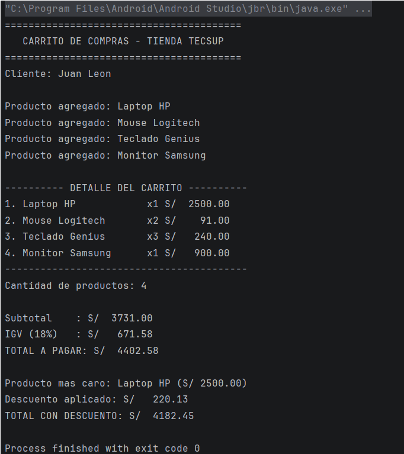

# Lab02 - Carrito de Compras Kotlin

**Autor:** Karim Sovero

## Descripción
Programa de consola en Kotlin que simula un carrito de compras para la Tienda TECSUP.
Registra productos, muestra el detalle del carrito con columnas alineadas, y calcula
el subtotal, IGV (18%), total, el producto más caro y el descuento por monto.

### Funciones implementadas
- `calcularSubtotal`: suma el precio por cantidad de todos los productos.
- `calcularIGV`: calcula el 18% del subtotal.
- `calcularTotal`: suma el subtotal más el IGV.
- `mostrarDetalle`: imprime el detalle del carrito con formato alineado.
- `calcularDescuento`: aplica descuento con `when` (5% si supera S/3000, 10% si supera S/5000).

## Captura de la consola

## Respuesta: val vs var
`nombre` y `precio` son `val` porque no cambian una vez creado el producto: el nombre y
el precio son fijos. `cantidad` es `var` porque sí puede cambiar, ya que el cliente puede
agregar o quitar unidades del producto.

Si se intenta cambiar el precio después de crear el producto, se produce un error de
compilación, porque `val` no permite reasignación en Kotlin.