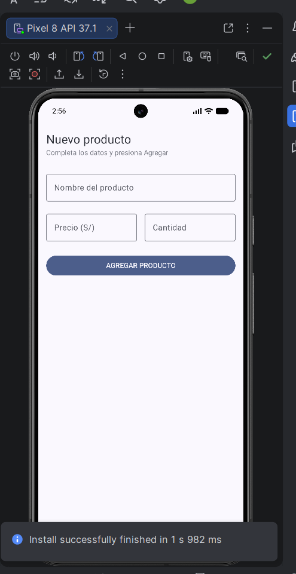
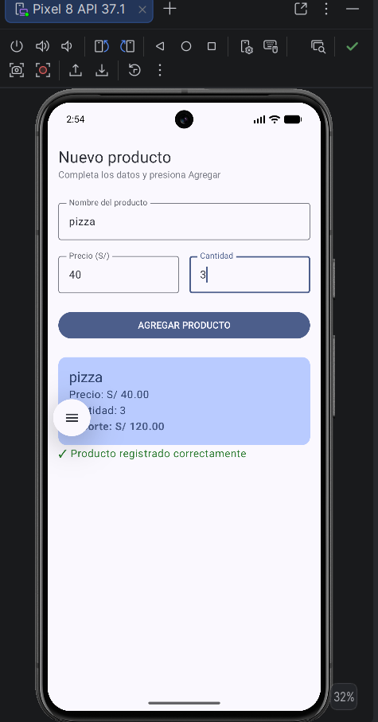

# Lab03 - Registro de Producto

**Alumno:** Karim Sovero
**Curso:** Programación en Móviles - Semana 03

## Descripción

Aplicación Android hecha con Jetpack Compose que permite registrar un producto.
El usuario ingresa nombre, precio y cantidad; al presionar AGREGAR PRODUCTO
aparece una Card con el resumen y el importe calculado (precio × cantidad) con
2 decimales.

## Capturas

Pantalla inicial (formulario vacío):

Después de presionar AGREGAR PRODUCTO:

## ¿Qué pasaría si declaras las variables de los campos SIN remember?

Al quitar el remember de la variable nombre y el campo no permite
escribir nada, se queda vacío. Sin remember, la variable se vuelve a crear
en cada recomposición, así que el valor que escribo se pierde de inmediato.
remember conserva el valor entre recomposiciones.