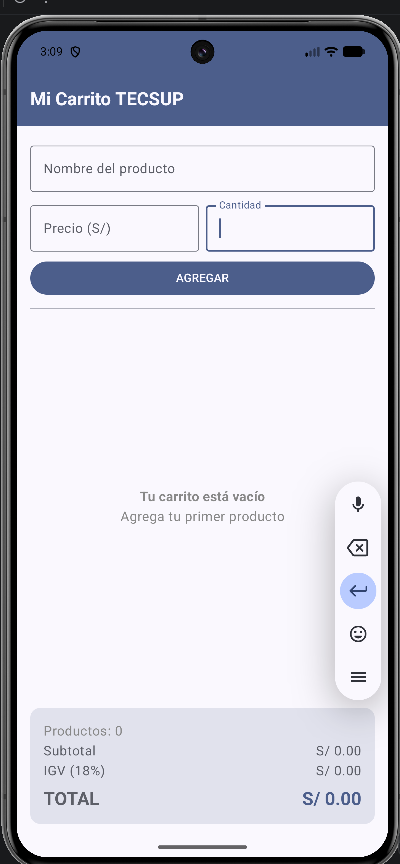
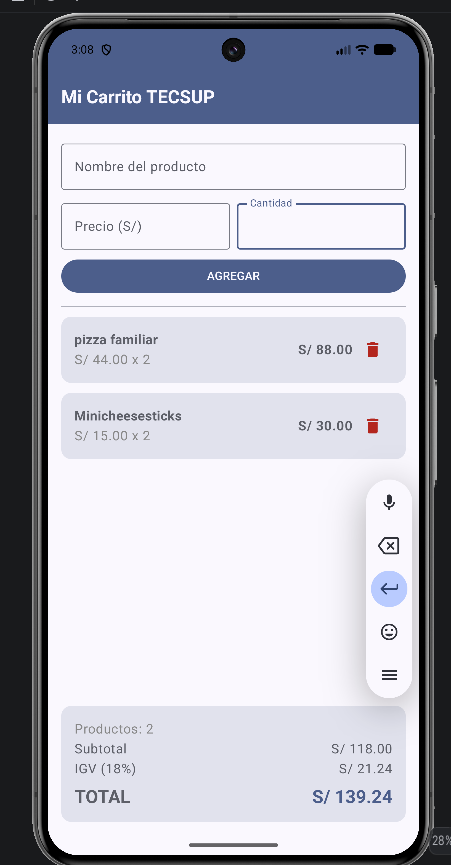

# Lab 04 - Mi Carrito TECSUP

**Alumno:** Karim Sovero

App de carrito de compras hecha con Kotlin y Jetpack Compose. Permite agregar
productos con nombre, precio y cantidad, verlos en una lista desplazable,
eliminarlos con el botón de tacho, y calcula el subtotal, el IGV (18%) y el
total en tiempo real. Cuando el carrito está vacío muestra un mensaje centrado
en lugar de la lista.

## Capturas

### Carrito vacío

### Con productos

## Respuestas conceptuales

### a) ¿Por qué mutableStateListOf y no una MutableList normal?

Porque `mutableStateListOf` es observable: cuando agrego o elimino un elemento,
Compose se entera y vuelve a dibujar la LazyColumn automáticamente. Con un
`mutableListOf` normal el producto sí se guardaría en la lista, pero la pantalla
no se enteraría del cambio y no aparecería nada hasta que otra cosa provoque una
recomposición.

### b) ¿Por qué la lista es val?

Porque `val` bloquea la reasignación de la variable, no el contenido del objeto.
Nunca hago `productos = otraLista`, siempre trabajo sobre la misma lista con
`.add()` y `.remove()`, que modifican lo de adentro. Además conviene que sea
`val`: si la reasignara perdería la lista que `remember` está guardando.

### c) ¿Qué hace weight(1f) en la LazyColumn?

Hace que la lista ocupe todo el alto que sobra de la Column, después de que el
formulario y el panel de totales tomaron el suyo. Así los totales quedan fijos
abajo y la lista crece o hace scroll dentro del espacio que le queda, sin
empujar nada fuera de la pantalla.